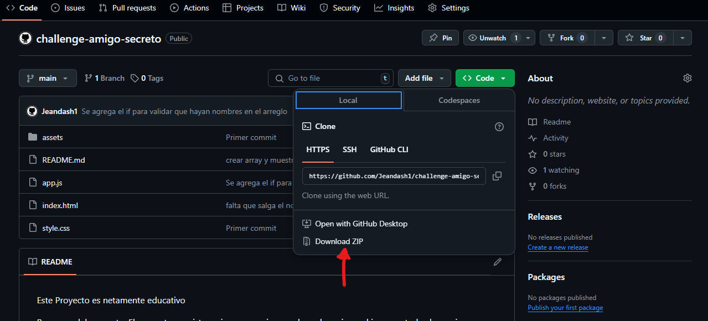
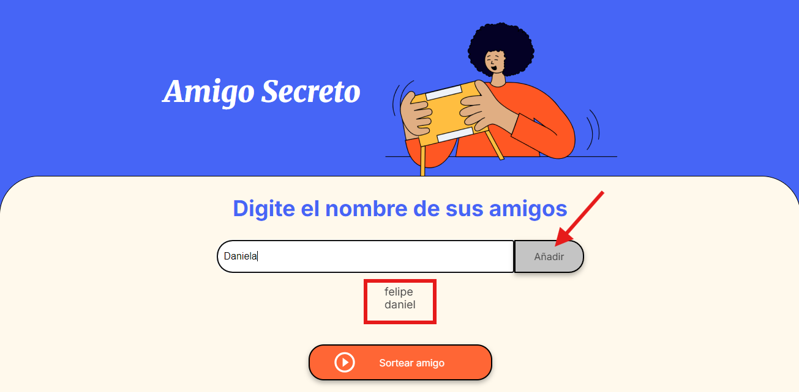
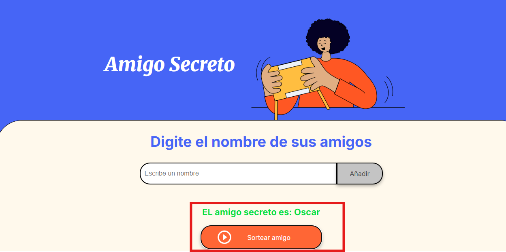

<em> Challenge amigo secreto </em>

!Este Proyecto es netamente educativo¡

Resumen del proyecto:
El proyecto consiste en ingresar varios nombres de amigos, al ingresar todos los amigos deseados puedes sortear el amigo al azar que se asignara a ti

<h2 aling="center"> Como descargar el proyecto </h2>

Descarga el proyecto como ZIP como se muestra en la imagen para poder visualizar el codigo fuente y como funciona 

si de lo contrario desea hacer puebas de maner directa ingresa al siguiente link: https://jeandash1.github.io/challenge-amigo-secreto/

<h3>Funcion del proyecto</h3>

cada ves que escribas un nombre y le dad clcik en añadir se van almazenando los nombres en el cuadro 

al darle cick en sortear amigo se mostrara el nombre en verde 